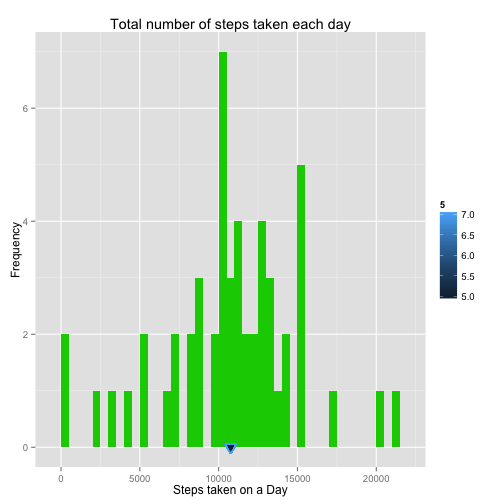
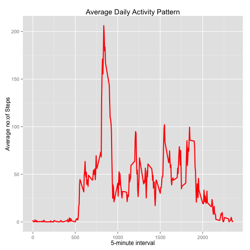
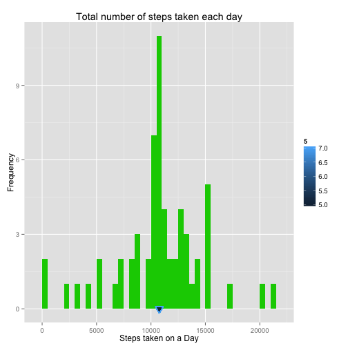
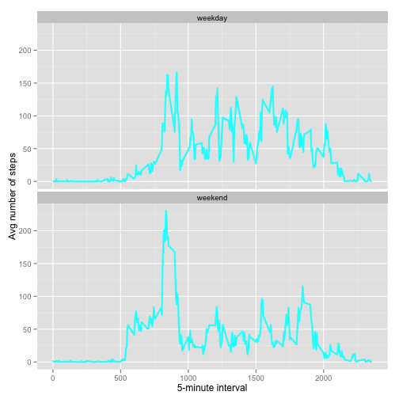

R Markdown Assigment on Activity Monitor
========================================

## Loading and preprocessing the data
Show any code that is needed to load and process data

### Load the data (i.e. read.csv())

```r
if(!file.exists("activity.csv")){
  unzip("activity.zip")
}
act <- read.csv("activity.csv", header = TRUE, colClasses = c("numeric", "character", "numeric"))
```
### Process/transform the data (if necessary) into a format suitable for your analysis

```r
act$date <- as.Date(act$date, format = "%Y-%m-%d")
head(act)
```

```
##   steps       date interval
## 1    NA 2012-10-01        0
## 2    NA 2012-10-01        5
## 3    NA 2012-10-01       10
## 4    NA 2012-10-01       15
## 5    NA 2012-10-01       20
## 6    NA 2012-10-01       25
```

```r
str(act)
```

```
## 'data.frame':	17568 obs. of  3 variables:
##  $ steps   : num  NA NA NA NA NA NA NA NA NA NA ...
##  $ date    : Date, format: "2012-10-01" "2012-10-01" ...
##  $ interval: num  0 5 10 15 20 25 30 35 40 45 ...
```

```r
summary(act)
```

```
##      steps            date               interval   
##  Min.   :  0.0   Min.   :2012-10-01   Min.   :   0  
##  1st Qu.:  0.0   1st Qu.:2012-10-16   1st Qu.: 589  
##  Median :  0.0   Median :2012-10-31   Median :1178  
##  Mean   : 37.4   Mean   :2012-10-31   Mean   :1178  
##  3rd Qu.: 12.0   3rd Qu.:2012-11-15   3rd Qu.:1766  
##  Max.   :806.0   Max.   :2012-11-30   Max.   :2355  
##  NA's   :2304
```

## What is mean total number of steps taken per day?
For this part of the assignment, you can ignore the missing values in the dataset.  
Note that steps and date have a many to many relation, hence the tilda in agg function.
### Make a histogram of the total number of steps taken each day
#### Each hour is 12 segements of five minutes, 0-55, 100-155, 200-255...

```r
aggsteps <- aggregate(steps ~ date, data = act, FUN = sum, na.action = na.omit)
head(aggsteps)
```

```
##         date steps
## 1 2012-10-02   126
## 2 2012-10-03 11352
## 3 2012-10-04 12116
## 4 2012-10-05 13294
## 5 2012-10-06 15420
## 6 2012-10-07 11015
```

```r
library(ggplot2)
ggplot(aggsteps, aes(x = steps))+
  geom_histogram(fill = 11, binwidth = 500)+
  geom_point(aes(x = mean(aggsteps$steps), y = 0, color = 5),size = 4, shape = 18)+
  geom_point(aes(x = median(aggsteps$steps), y = 0, color = 7), size = 4, shape = 25)+
  labs(x = "Steps taken on a Day", y = "Frequency", title = "Total number of steps taken each day")
```

 
### Calculate and report the mean and median total number of steps taken per day

```r
mean(aggsteps$steps)
```

```
## [1] 10766
```

```r
median(aggsteps$steps)
```

```
## [1] 10765
```

### What is the average daily activity pattern?
Make a time series plot (i.e. type = "l") of the 5-minute interval (x-axis) and the average number of steps taken, averaged across all days (y-axis)

```r
aggint <- aggregate(act$steps, by = list(act$interval), FUN = mean, na.rm = TRUE)
colnames(aggint) <- c("interval", "mean")
head(aggint)
```

```
##   interval    mean
## 1        0 1.71698
## 2        5 0.33962
## 3       10 0.13208
## 4       15 0.15094
## 5       20 0.07547
## 6       25 2.09434
```

```r
str(aggint)
```

```
## 'data.frame':	288 obs. of  2 variables:
##  $ interval: num  0 5 10 15 20 25 30 35 40 45 ...
##  $ mean    : num  1.717 0.3396 0.1321 0.1509 0.0755 ...
```

```r
ggplot(aggint, aes(x = interval, y = mean)) +
  geom_line(color  = 10, size = 1) +
  labs(x = "5-minute interval", y = "Average no:of Steps", title = "Average Daily Activity Pattern")
```

 

### Which 5-minute interval, on average across all the days in the dataset, contains the maximum number of steps?

```r
aggint[which.max(aggint$mean),]
```

```
##     interval  mean
## 104      835 206.2
```

### Imputing missing values
Note that there are a number of days/intervals where there are missing values (coded as NA). The presence of missing days may introduce bias into some calculations or summaries of the data.

### Calculate and report the total number of missing values in the dataset (i.e. the total number of rows with NAs)

```r
library(sqldf)
```

```
## Loading required package: gsubfn
## Loading required package: proto
## Loading required package: RSQLite
## Loading required package: DBI
## Loading required package: RSQLite.extfuns
```

```r
nrow(sqldf('select * from act where steps IS NULL order by date, interval'))
```

```
## Loading required package: tcltk
```

```
## [1] 2304
```
### Devise a strategy for filling in all of the missing values in the dataset. The strategy does not need to be sophisticated. For example, you could use the mean/median for that day, or the mean for that 5-minute interval, etc.

```r
# there are days without a single signicant value, hence using mean of interval to fill NA
act3 <- act
act3 <- sqldf('SELECT a.*, b.mean FROM aggint as b JOIN act as a ON a.interval = b.interval ORDER BY a.date, b.interval')
```
### Create a new dataset that is equal to the original dataset but with the missing data filled in.

```r
act3$steps[is.na(act3$steps)] <- act3$mean[is.na(act3$steps)]
head(act3)
```

```
##     steps       date interval    mean
## 1 1.71698 2012-10-01        0 1.71698
## 2 0.33962 2012-10-01        5 0.33962
## 3 0.13208 2012-10-01       10 0.13208
## 4 0.15094 2012-10-01       15 0.15094
## 5 0.07547 2012-10-01       20 0.07547
## 6 2.09434 2012-10-01       25 2.09434
```
### Make a histogram of the total number of steps taken each day and Calculate and report the mean and median total number of steps taken per day. Do these values differ from the estimates from the first part of the assignment? What is the impact of imputing missing data on the estimates of the total daily number of steps?

```r
aggsteps3 <- aggregate(steps ~ date, data = act3, FUN = sum, na.action = na.omit)
ggplot(aggsteps3, aes(x = steps))+
  geom_histogram(fill = 11, binwidth = 500)+
  geom_point(aes(x = mean(aggsteps3$steps), y = 0, color = 5),size = 4, shape = 18)+
  geom_point(aes(x = median(aggsteps3$steps), y = 0, color = 7), size = 4, shape = 25)+
  labs(x = "Steps taken on a Day", y = "Frequency", title = "Total number of steps taken each day")
```

 

```r
mean(aggsteps3$steps)
```

```
## [1] 10766
```

```r
median(aggsteps3$steps)
```

```
## [1] 10766
```
## THE MEAN AND MEDIAN DID NOT CHANGE
## IMPACT OF IMPUTING MISSING VALUES: NOT SIGNIFICANT

### Are there differences in activity patterns between weekdays and weekends?
For this part the weekdays() function may be of some help here. Use the dataset with the filled-in missing values for this part.

Create a new factor variable in the dataset with two levels – “weekday” and “weekend” indicating whether a given date is a weekday or weekend day.

```r
act3$daytype <- as.factor(ifelse(weekdays(act3$date) %in% c("Saturday", "Sunday"), "weekday", "weekend"))

act4 <- sqldf('SELECT interval, avg(steps) as avgsteps, daytype FROM act3 GROUP BY daytype, interval ORDER BY interval')
```


Make a panel plot containing a time series plot (i.e. type = "l") of the 5-minute interval (x-axis) and the average number of steps taken, averaged across all weekday days or weekend days (y-axis).


```r
ggplot(act4, aes(x = interval, y = avgsteps))+
  geom_line(color = 21, size = 1)+
  facet_wrap(~ daytype, nrow=2, ncol=1)+
  labs(x = "5-minute interval", y = "Avg number of steps")
```

 
## AVERAGE STEPS TAKEN IS MORE THAN 100 FOR SEVERAL INSTANCES (HOURS) DURING WEEKEND COMPARED TO AROUND 2 INSTANCES DURING WEEKDAY. 
